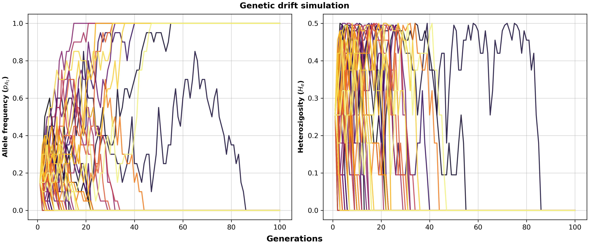
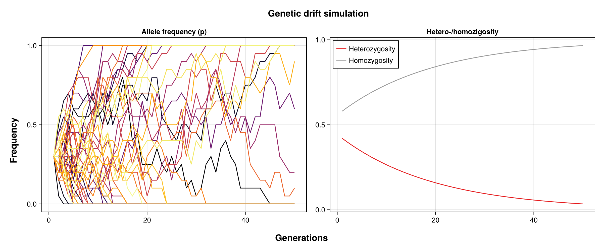

# Genetic Drift Simulation

[](https://www.python.org/downloads/)
[](https://julialang.org/)
[](https://opensource.org/licenses/MIT)

> Stochastic simulation of allele frequencies and heterozygosity under the Wright-Fisher model.

## Overview

This repository aims to implement a genetic drift simulation in both Python and Julia. The first one follows the algorithm described by [Dr. Laura Figueroa-Corona](https://liigh.unam.mx/newpage/perfil.php?n=30) in the course of Evolution and Population Genetics. On the other hand, Julia's implementation is based on [1], which was provided by [Dr. Mashaal Sohail](https://www.ccg.unam.mx/mashaal-sohail/) for the Human Genomics course at the [B.Sc. in Genomic Sciences](https://www.lcg.unam.mx).

In both cases, the code simulates genetic drift according to the [Wright-Fisher model](https://www.sciencedirect.com/topics/biochemistry-genetics-and-molecular-biology/wright-fisher-model), in which random sampling leads to allele fixation, allele loss, reduced heterozygosity, and coalescence (see Python's implementation).

## Wright-Fisher Model

This models a single evolutive force (genetic drift) with the following assumptions:

* Panmictic population
* Constant population size
* Hermaphroditic individuals
* Discrete generations

Because the sampling is stochastic, the allele frequency depends only on the population size.

## Repository Structure
```text
.
├── LICENSE
├── Manifest.toml
├── Project.toml
├── README.md
├── results
│   └── images
│       ├── genetic-drift_allelefreq.png
│       └── genetic-drift_hetero-homo.png
└── src
    ├── genetic_drift.ipynb
    └── genetic_drift.jl
```

# Running the Simulation

## Python's Implementation

This uses a **multinomial distribution** to randomly sample allele counts because it generalizes the binomial distribution and allows tracking which alleles have been inherited to the next generation. The latter feature was added for a coalescence exercise.In addition, the heterozygosity is computed as follows:

$$
H_e = 2p(1-p)
$$



## Julia's Implementation

This one uses the traditional **binomial distribution** as it was not intended for tracking the individual copies each allele inherits to the next generation. In contrast with the Python's version, here I computed the heterozygosity $H_e$ as an exponential decay function of time (Gillespie, 2004, p. 50):

$$
H_e(t) = H_0(1-\frac{1}{2N})^{t-1}, \text{ }t > 0
$$



Usage example:

```shell
julia --project=. ./src/genetic_drift.jl \
    -i 10 -p 0.3 \
    -g 50 -t 0.42 \
    -o results/images
```

For more information on the parameters, run:

```shell
julia --project=. ./src/genetic_drift.jl -h
```